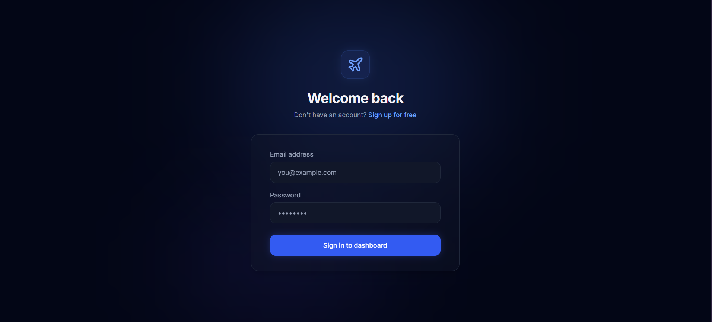
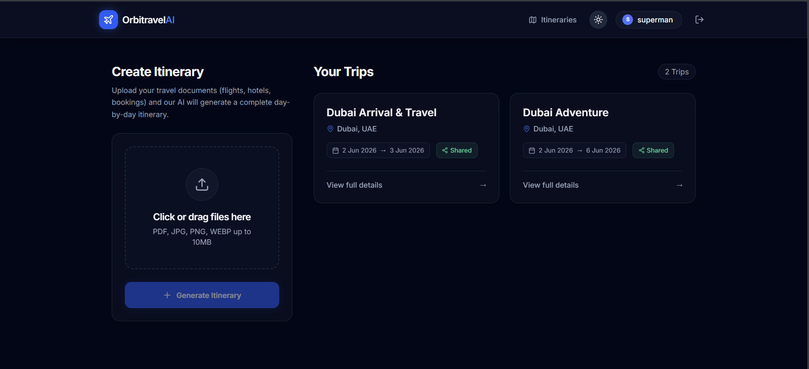
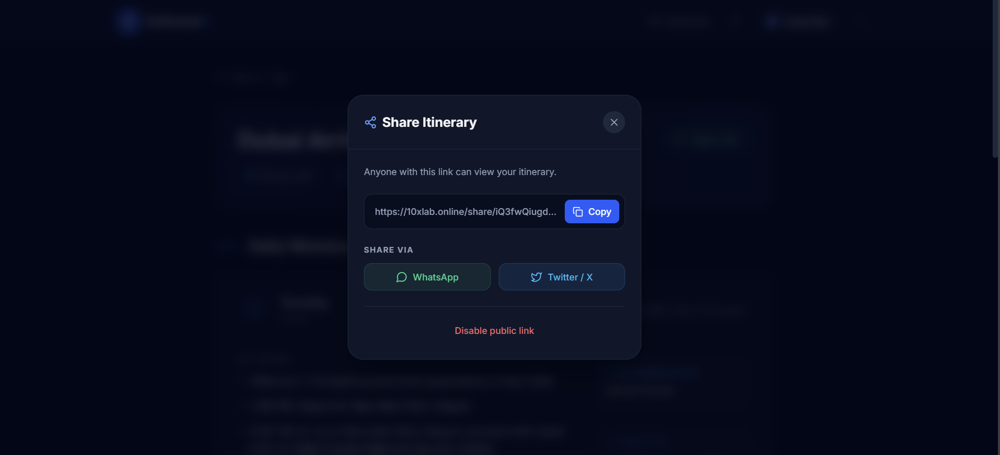

# TravelAI — AI-Powered Travel Itinerary Generator

A full-stack MERN application that lets users upload travel booking documents (flights, hotels, train tickets) and automatically generates a structured AI-powered itinerary.

**Live Demo:** https://10xlab.online  
**API:** https://api.10xlab.online

---

## Features

- **JWT Authentication** — Secure login/register with httpOnly cookies (XSS-safe) and refresh token rotation
- **Document Upload** — Upload PDFs and images (flight tickets, hotel bookings, travel docs)
- **AI Extraction** — Gemini 1.5 Flash extracts structured travel data from uploaded documents
- **Itinerary Generation** — Automatically generates a day-by-day travel plan from extracted booking data
- **History** — View all previously generated itineraries
- **Sharing** — Toggle public sharing per itinerary via unique share link
- **Redis Caching** — API responses cached for optimised performance
- **AWS S3** — File storage with local fallback for development
- **Rate Limiting** — Three-tier rate limiting to prevent abuse
- **Dockerised** — Multi-stage Docker build, deployed on EC2 with Nginx reverse proxy

---

## Tech Stack

### Backend
| Layer | Technology |
|---|---|
| Runtime | Node.js + Express.js |
| Language | TypeScript |
| Database | MongoDB + Mongoose |
| Cache | Redis (ioredis) |
| Auth | JWT (httpOnly cookies) + bcryptjs |
| AI | Google Gemini 1.5 Flash |
| File Storage | AWS S3 / Multer (local fallback) |
| Validation | Zod |
| Deployment | Docker + EC2 + Nginx |

### Frontend
| Layer | Technology |
|---|---|
| Framework | React 18 + Vite |
| Language | TypeScript |
| Styling | Tailwind CSS |
| Routing | React Router v6 |
| HTTP | Axios (with interceptors) |
| Icons | Lucide React |
| Deployment | Netlify |

---

## Project Structure

```
orbitra-travel-ai/
├── client/                        # React + Vite + Tailwind
│   └── src/
│       ├── api/                   # axios instance + API calls
│       ├── components/            # Navbar, FileUploader, ItineraryCard
│       ├── context/               # AuthContext
│       ├── pages/                 # Login, Register, Dashboard, ItineraryDetail, SharedItinerary
│       └── types/                 # TypeScript interfaces
│
├── server/                        # Node + Express + TypeScript
│   ├── src/
│   │   ├── config/                # db.ts, env.ts (Zod), redis.ts
│   │   ├── controllers/           # auth, upload, itinerary
│   │   ├── middlewares/           # auth, error, rateLimiter, upload
│   │   ├── models/                # User, Document, Itinerary
│   │   ├── routes/                # auth, upload, itinerary
│   │   ├── services/              # ai.service, s3.service, itinerary.service
│   │   ├── utils/                 # AppError, asyncHandler, setCookie, cache
│   │   └── app.ts
│   └── server.ts
│
├── docker-compose.yml
└── README.md
```

---

## API Reference

```
POST   /api/auth/register              Register + set auth cookies
POST   /api/auth/login                 Login + set auth cookies
POST   /api/auth/refresh               Rotate tokens
POST   /api/auth/logout                Clear cookies
GET    /api/auth/me                    Get current user

POST   /api/upload                     Upload docs → extract → generate itinerary

GET    /api/itineraries                Get history (paginated)
GET    /api/itineraries/:id            Get single itinerary
PATCH  /api/itineraries/:id/share      Toggle public sharing
GET    /api/itineraries/shared/:token  Public share (no auth)
DELETE /api/itineraries/:id            Delete itinerary
```

---

## Local Development

### Prerequisites
- Node.js 20+
- MongoDB
- Redis
- Docker (optional)

### 1. Clone the repo

```bash
git clone https://github.com/barikbibek/orbitra-travel-ai.git
cd orbitra-travel-ai
```

### 2. Backend setup

```bash
cd server
cp .env.example .env
# Fill in your values in .env
npm install
npm run dev
```

### 3. Frontend setup

```bash
cd client
npm install
npm run dev
```

### 4. Or run everything with Docker

```bash
# From root
docker-compose up --build
```

Frontend: http://localhost:5173  
Backend: http://localhost:5000

---

## Environment Variables

```bash
# server/.env
PORT=5000
NODE_ENV=development

MONGODB_URI=mongodb://localhost:27017/travel-ai
REDIS_URL=redis://localhost:6379

JWT_SECRET=your_jwt_secret_minimum_32_characters
JWT_EXPIRES_IN=15m
REFRESH_TOKEN_SECRET=your_refresh_secret_minimum_32_characters
REFRESH_TOKEN_EXPIRES_IN=7d

GEMINI_API_KEY=your_gemini_api_key

# Optional — falls back to local storage if not set
AWS_ACCESS_KEY_ID=
AWS_SECRET_ACCESS_KEY=
AWS_REGION=ap-south-1
AWS_BUCKET_NAME=

CLIENT_URL=http://localhost:5173
```

---

## Deployment

### Backend — EC2 + Docker + Nginx

```bash
# On EC2 instance
git clone https://github.com/barikbibek/orbitra-travel-ai.git
cd orbitra-travel-ai/server
cp .env.example .env && nano .env

docker-compose up -d --build
```

Nginx reverse proxy (`/etc/nginx/sites-available/travel-ai`):

```nginx
server {
    listen 80;
    server_name api.10xlab.online;

    location / {
        proxy_pass         http://localhost:5000;
        proxy_http_version 1.1;
        proxy_set_header   Upgrade $http_upgrade;
        proxy_set_header   Connection 'upgrade';
        proxy_set_header   Host $host;
        proxy_cache_bypass $http_upgrade;
    }
}
```

### Frontend — Netlify

Connect repo to Netlify, set build command to `npm run build` and publish directory to `dist`.

Add environment variable in Netlify dashboard:
```
VITE_API_URL=https://api.10xlab.online
```

---

## Security Highlights

- JWT stored in **httpOnly cookies** — immune to XSS attacks
- **Refresh token rotation** — new token pair on every refresh
- **Three-tier rate limiting** — auth (10 req/15min), upload (20 req/hr), general (100 req/15min)
- **Helmet.js** — secure HTTP headers
- **Zod validation** — all env vars and request bodies validated at runtime
- **bcrypt (cost=12)** — password hashing
- Identical error message for wrong email/password — prevents user enumeration

---

## Architecture Highlights

- **Service layer pattern** — controllers are thin, all logic in services
- **Redis caching** — itinerary history (2min TTL), detail (10min), shared (15min)
- **Cache invalidation** — on create/update/delete, relevant cache keys cleared
- **Parallel document processing** — `Promise.all` for multi-file upload + extraction
- **Graceful S3 fallback** — app works without AWS credentials (local storage)
- **Multi-stage Docker build** — production image has no devDependencies or TypeScript

---

## Screenshots


### Login Page



### Dashboard



### Sharable Link Page



---

